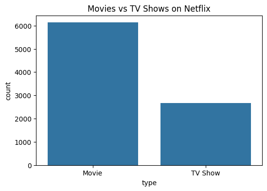
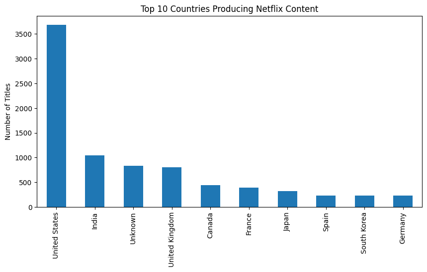
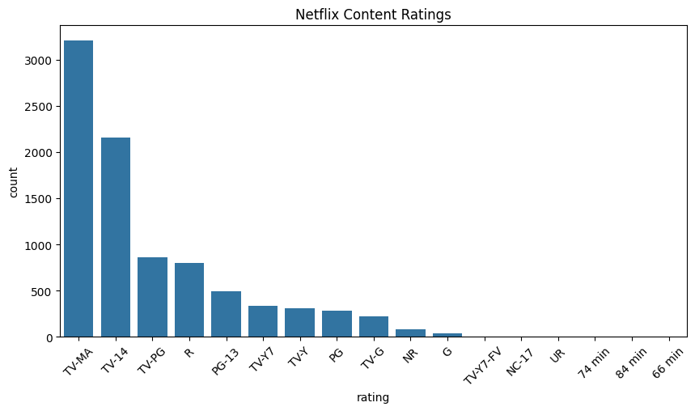
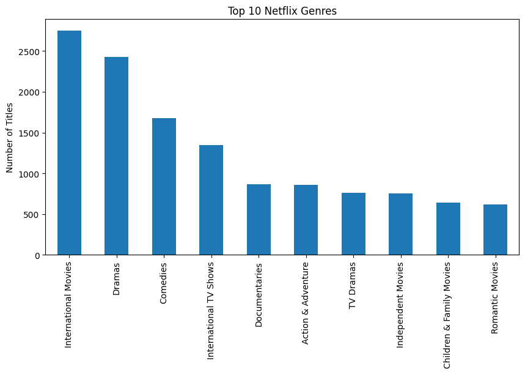
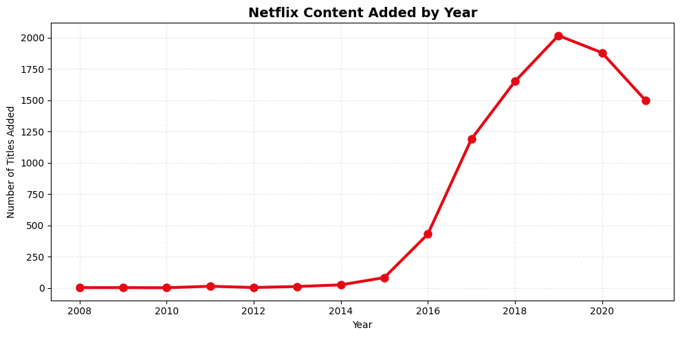
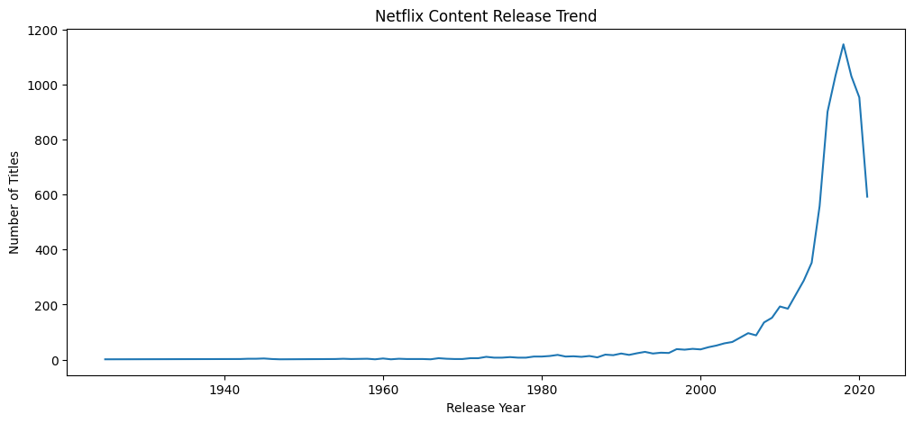

# Netflix Content Analysis

## Project Overview

This project presents an end-to-end analysis of the Netflix Movies and TV Shows dataset. The objective was to clean, validate, and analyze Netflix's content library to uncover trends in content distribution, audience targeting, genre popularity, and platform growth.

Python was used for data cleaning, exploratory data analysis (EDA), and visualization, while PostgreSQL was used to validate key findings through SQL queries.

---

## Objectives

* Clean and prepare the dataset for analysis.
* Identify and handle data quality issues.
* Explore content distribution and audience trends.
* Analyze content growth and release patterns.
* Validate findings using PostgreSQL.
* Generate actionable insights from the data.

---

## Dataset Information

**Source:** Kaggle – Netflix Movies and TV Shows Dataset

**Records Analyzed:** 8,797 Titles

**Key Features:**

* Content Type
* Title
* Country
* Rating
* Release Year
* Date Added
* Genre Categories
* Duration

---

## Data Cleaning and Preparation

The following data cleaning activities were performed:

* Handled missing values in director, cast, country, and rating fields.
* Removed records with missing critical date information.
* Checked and removed duplicate records.
* Converted date fields to proper datetime format.
* Standardized column names for consistency.
* Created a `year_added` feature for trend analysis.
* Validated data quality before analysis.

---

## Exploratory Data Analysis (EDA)

### 1. Content Type Distribution



**Insight:** Movies account for approximately 70% of Netflix's catalogue, making them the dominant content type.

### 2. Geographic Distribution



**Insight:** The United States contributes the highest number of titles, followed by India and the United Kingdom.

### 3. Audience Rating Analysis



**Insight:** TV-MA and TV-14 are the most common ratings, indicating a strong focus on teenage and adult audiences.

### 4. Genre Analysis



**Insight:** International Movies, Dramas, and Comedies are among the most represented content categories.

### 5. Content Added to Netflix by Year



**Insight:** Netflix experienced rapid catalogue expansion between 2016 and 2019, with content additions peaking in 2019.

### 6. Content Release Trends



**Insight:** Most titles were released after 2000, showing a strong emphasis on contemporary content.

---

## Key Findings

* Movies dominate Netflix's content library.
* The United States remains the leading content producer.
* Netflix primarily targets mature audiences.
* International content plays a significant role in the catalogue.
* Content growth accelerated significantly between 2016 and 2019.
* Drama remains one of the platform's most common genres.

---

## Recommendations

* Continue investing in international content to support global audience growth.
* Expand family-friendly content to diversify audience reach.
* Maintain a balanced mix of movies and TV shows.
* Prioritize high-performing genres such as Drama and International content.
* Monitor content growth trends to guide future content acquisition strategies.

---

## SQL Validation

PostgreSQL was used to independently validate key findings from the Python analysis.

Validation included:

* Total record count
* Content type distribution
* Country analysis
* Ratings analysis
* Genre analysis
* Release year analysis
* Content growth trends

All SQL results were consistent with the Python findings, confirming the reliability of the analysis.

---

## Tools and Technologies

### Python

* Pandas
* NumPy
* Matplotlib
* Seaborn

### Database

* PostgreSQL
* pgAdmin

### Environment

* Jupyter Notebook
* Visual Studio Code

---

## Project Structure

```text
Netflix_Project/
│
├── netflix_cleaned.csv
├── analysis.ipynb
├── Netflix_SQL.sql
├── Netflix_Report.pdf
├── README.md
│
├── Visualizations/
│   ├── movies_vs_tvshows.png
│   ├── top_countries.png
│   ├── ratings_distribution.png
│   ├── top_genres.png
│   ├── content_added_by_year.png
│   └── release_trend.png
```

---

## Business Value

This project demonstrates practical skills in data cleaning, exploratory data analysis, data visualization, and SQL validation. The findings provide valuable insight into Netflix's content strategy, audience preferences, and catalogue growth patterns.

---

## Conclusion

The analysis revealed that Netflix maintains a movie-focused catalogue, is heavily influenced by content from the United States, and primarily serves mature audiences. The platform has also experienced significant growth over the last decade while continuing to expand its international content offerings. These findings highlight how data analytics can be used to better understand trends within the streaming industry.
